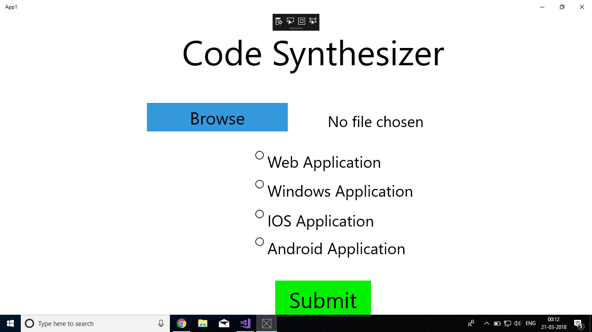
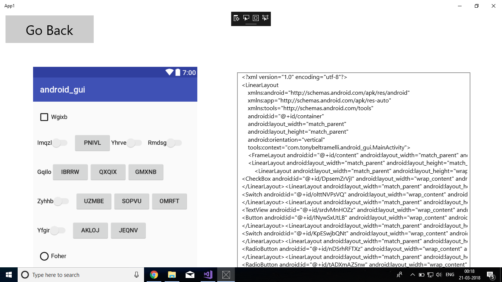

# code-synthesizer
Generate xml, html, xaml, ios shift code from graphical user interface.

We present a way to minimise the time required for the initial start of a design to final product which requires iteration during its course of development. In order to build a website, mobile application, a developer has to implement the graphical user interface mockup created by a designer which is usually time consuming. 
Therefore our idea is to provide a platform for people to submit their GUI mockup and we present them the HTML, Android, IOS code to increase their productivity and reduce the time required for prototyping.

IMPLEMENTATION
The task of generating code from a GUI screenshot can be compared to the task of generating textual descriptions of an image. In both scenarios, we want to produce variable length strings of tokens from pixel values. Thus the problem can be divided into 3 subproblems. First, a computer vision problem of understanding the GUI image and inferring the objects present, their identities, positions, and poses (i.e. buttons, labels, element containers). Second, a language modelling problem of understanding computer code and generating syntactically correct samples. Finally, the last challenge is to combine both solutions by exploiting the latent variables inferred from image to generate corresponding computer code of the objects represented by these variables.
Convolutional Neural Network would be used for unsupervised feature learning by mapping into image to a fixed length vector and an encoder-decoder architecture for sequentially code generation based on the previously generated vector.

ARCHITECTURE
We have developed a Windows Application to host our application and model. The user has to submit his design and select the platform. All the computation required will be performed on the server and the code generated would be sent back to the user.

Please find useful screenshots.

